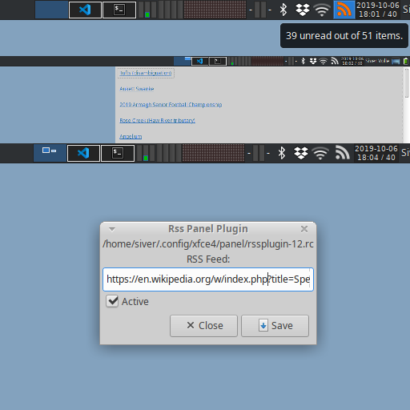

Xfce4-panel RSS Plugin.
=======================



A simple Xfce4-panel plugin for reading RSS, and notifying on new unread content. The plugin is written with Rust, except for the seven or so lines of C necessary in order to make `XFCE_PANEL_PLUGIN_REGISTER` work. 


Installation:
-------------

### Prerequisites:

Installing from a fresh Xubuntu in a VirtualBox leads to these prerequisites, before the plugin could be built and installed from source:

0. Xfce libraries:
  - `apt install libxfce4panel-2.0 libxfce4ui-common libxfce4ui-2-0`
1. GCC:
  - `apt install gcc`
2. [Rust/Cargo](https://www.rust-lang.org/tools/install):
  - `curl https://sh.rustup.rs -sSf | sh`
3. [OpenSSL for the RSS crate](https://docs.rs/openssl/0.10.25/openssl/#automatic):
  - `apt install pkg-config libssl-dev`
4. [Gtk for the gtk-rs crate](https://gtk-rs.org/docs-src/requirements):
  - `apt install libgtk-3-dev`


### Installing the plugin

Run `cargo build --release` to make sure everything is installed properly.


```
cargo build --release  # building the rust parts
./make.sh              # creating the plugin librssplugin.so file 
sudo ./install.sh      # moving the .so, .desktop, and .svg files, clear icon cache.
xfce4-panel -r         # restart the panel.
```

The RSS Plugin should now be available to add.

### Known problems:

- A fresh Xubuntu install has no `/usr/lib/xfce4/panel-plugins/`-folder. If this is the case for you, run `mkdir -p /usr/lib/xfce4/panel-plugins`.
- On the same Xubuntu install as above, the icon cache was not cleared. This resulted in no icon on the add-menu and about dialog, but otherwise has no effect. The icon in the panel is based on svg as a string within the code.  


Future:
-------

- Cookies and custom headers.
- Configurable polling-interval
- Visually pleasing item-view
- Configurable item-view, icons and colors
- Better, more idiomatic, rust.
- Remove last dependency of C


Credit:
-------

Using:
- [Rust](https://www.rust-lang.org/)
- [Gtk-rs](https://gtk-rs.org/)
- [Xfce4-panel](https://docs.xfce.org/xfce/xfce4-panel/start)
- [RS's RSS](https://github.com/rust-syndication/rss)
- [Shrinkwraprs](https://lib.rs/crates/shrinkwraprs)

Inspired by:
- [The Xfce4 Sample Plugin](https://git.xfce.org/panel-plugins/xfce4-sample-plugin/) and the accompanying [how-to guide for panel plugins](https://wiki.xfce.org/dev/howto/panel_plugins)
- [gDiceRoller](https://gitlab.gnome.org/NoraCodes/gdiceroller/) and the accompanying [tutorial on GTK with rust](https://nora.codes/tutorial/speedy-desktop-apps-with-gtk-and-rust/)
- Shrinkwrapping and Message Passing, as suggested by [Best Practices With GTK + Rust](https://mmstick.keybase.pub/rust-gtk-practices/)


For everything else:
- [Feel free to use, copy, modify, and/or distribute this software for any purpose with or without fee](https://opensource.org/licenses/0BSD)
